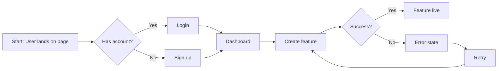
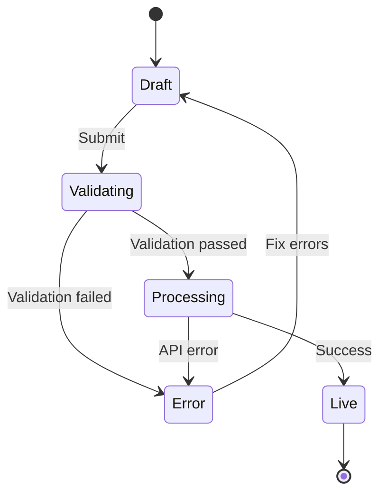

# Artifact Templates

Standard templates for common design artifacts. Use these as starting points, adapting to context.

---

## User Journey Map (FigJam)

### Structure

```
[Phase 1: Awareness] → [Phase 2: Consideration] → [Phase 3: Action] → [Phase 4: Outcome]
```

### Components per Phase

1. **User Goal** (sticky note - blue)
   - What the user is trying to accomplish

2. **Actions** (sticky note - yellow)
   - Specific steps the user takes

3. **Touchpoints** (sticky note - green)
   - UI screens, emails, notifications

4. **Pain Points** (sticky note - red)
   - Frustrations, blockers, confusion
   - Include frequency: "(mentioned 3x)"
   - Include source: "[Acme Corp interview, Jan 15]"

5. **Opportunities** (sticky note - purple)
   - Improvement ideas from research
   - Include source meeting

6. **Emotional State** (line graph or emoji indicators)
   - Positive/neutral/negative throughout journey

7. **Screenshots** (embedded images)
   - Current UI state at each touchpoint
   - Video screenshots if available

### Example FigJam Layout

```
┌─────────────────────────────────────────────────────────────────────┐
│  JOURNEY: Feature Setup                                             │
│  Customer: Mid-market User | Date: Jan 2026                        │
├─────────────────────────────────────────────────────────────────────┤
│                                                                      │
│  [DISCOVER]        [CONFIGURE]       [MAP]           [GO LIVE]      │
│                                                                      │
│  ┌─────────┐       ┌─────────┐      ┌─────────┐     ┌─────────┐    │
│  │ Goal:   │       │ Goal:   │      │ Goal:   │     │ Goal:   │    │
│  │ Find    │  →    │ Set up  │  →   │ Map     │  →  │ Publish │    │
│  │ feature │       │ auth    │      │ fields  │     │ live    │    │
│  └─────────┘       └─────────┘      └─────────┘     └─────────┘    │
│                                                                      │
│  [Screenshot]      [Screenshot]     [Screenshot]    [Screenshot]    │
│                                                                      │
│  Pain:             Pain:            Pain:           Pain:           │
│  "Where do I      "Error message   "Don't know     "No preview"    │
│  start?"          unclear"         what to map"    (4x mentions)   │
│  [Workshop]       [Acme Corp]      [Design Rev]    [multiple]      │
│                                                                      │
│  ────────────────── EMOTION ──────────────────────                  │
│       😐              😟               😟              😤            │
│                                                                      │
│  Opportunity:      Opportunity:     Opportunity:    Opportunity:    │
│  Guided first      Better error     AI-assisted     Preview        │
│  feature           context          mapping         before pub     │
└─────────────────────────────────────────────────────────────────────┘
```

---

## Interactive Prototype

### File Structure (frontend-design skill)

```
prototype/
├── src/
│   ├── components/
│   │   ├── [FeatureName]/
│   │   │   ├── index.tsx
│   │   │   ├── [SubComponent].tsx
│   │   │   └── types.ts
│   │   └── ui/           # Shared UI components
│   ├── pages/            # Route pages
│   ├── hooks/            # Custom hooks
│   └── styles/           # Global styles
├── public/
└── package.json
```

### State Documentation

```markdown
## Prototype States

### Happy Path
1. Initial state → [screenshot/description]
2. User action → [screenshot/description]
3. Success state → [screenshot/description]

### Error States
1. Validation error → [screenshot/description]
   - Source: "[Meeting name, date]"
2. API error → [screenshot/description]
3. Empty state → [screenshot/description]

### Edge Cases
- [Case from user research]
- [Case from design review]
```

---

## Wireframes

### Fidelity Levels

**Lo-Fi (Quick exploration)**
- Boxes and labels only
- No styling, no colors
- Focus on layout and hierarchy
- Tool: Mermaid or quick HTML

**Mid-Fi (Stakeholder review)**
- Grayscale with typography hierarchy
- Real content (not lorem ipsum)
- Basic interactions noted
- Tool: FigJam or HTML/CSS

**Hi-Fi (Development handoff)**
- Full design system components
- Actual colors, spacing, typography
- All states documented
- Tool: Figma or frontend-design skill

### Annotation Format

```markdown
## Screen: [Name]

### Layout
[ASCII or embedded image]

### Interactions
- [Element] → [Action] → [Result]
- [Element] → [Action] → [Result]

### Content Requirements
- [Field]: [Requirements/constraints]
- [Field]: [Requirements/constraints]

### Accessibility Notes
- Focus order: [1, 2, 3...]
- ARIA labels: [requirements]

### Evidence
- Pain point addressed: "[quote]" - [source]
- Decision: "[decision]" - [source meeting]
```

---

## Research Synthesis Document

### Mirka Format (for user interviews)

```markdown
# Synthesis: Key findings from [Customer] interview

## Pain Points Confirmed
1. **[Pain point title]**
   - Evidence: "[verbatim quote]"
   - Context: [when/why this came up]
   - Frequency: [how often mentioned]

2. **[Pain point title]**
   - Evidence: "[verbatim quote]"
   - Context: [when/why this came up]

## Notable Quotes

| Quote | Theme | Context |
|-------|-------|---------|
| "[verbatim]" | [Theme] | [Context] |
| "[verbatim]" | [Theme] | [Context] |

## Implications

- **[Category]**: [What this means for product]
- **[Category]**: [What this means for product]

## Suggested Next Steps

1. **[Action]** - [Brief rationale]
2. **[Action]** - [Brief rationale]

## Final Summary
[2-3 sentences capturing key takeaway]

---
**Metadata**
- Customer: [Name]
- Date: [Date]
- User Impact Relevance: YES/PARTIAL/NO
- Theme Alignment: [Self-Service UX / Retention / Product Cloud / Enablement]
```

---

## Demo Video (Remotion)

### Script Structure

```markdown
## Video: [Title]
Duration: [X minutes]
Audience: [Sales team / Customer / Internal]

### Scenes

#### Scene 1: Problem Setup (0:00 - 0:30)
- Narration: "[Script]"
- Visual: [Description]
- Source: [Meeting where problem was identified]

#### Scene 2: Solution Demo (0:30 - 2:00)
- Narration: "[Script]"
- Visual: [Screen recording / Animation]
- Key moment: [timestamp] - [what to emphasize]

#### Scene 3: Outcome (2:00 - 2:30)
- Narration: "[Script]"
- Visual: [Results / Metrics]

### Assets Needed
- [ ] Screen recordings
- [ ] Product screenshots
- [ ] Icons/graphics
- [ ] Background music (optional)
```

---

## FigJam Board (General)

### Board Sections

```
┌────────────────────────────────────────────────────────────────┐
│  TITLE: [Topic]                                                │
│  Date: [Date] | Participants: [Names]                         │
├────────────────────────────────────────────────────────────────┤
│                                                                 │
│  ┌──────────────┐  ┌──────────────┐  ┌──────────────┐         │
│  │   CONTEXT    │  │   INSIGHTS   │  │   ACTIONS    │         │
│  │              │  │              │  │              │         │
│  │ - Background │  │ - Finding 1  │  │ - Next step  │         │
│  │ - Goals      │  │ - Finding 2  │  │ - Owner      │         │
│  │ - Scope      │  │ - Finding 3  │  │ - Timeline   │         │
│  │              │  │              │  │              │         │
│  └──────────────┘  └──────────────┘  └──────────────┘         │
│                                                                 │
│  ┌──────────────────────────────────────────────────┐         │
│  │                 EVIDENCE WALL                     │         │
│  │                                                   │         │
│  │  [Screenshot]  [Quote]  [Screenshot]  [Quote]    │         │
│  │  [source]      [source] [source]      [source]   │         │
│  │                                                   │         │
│  └──────────────────────────────────────────────────┘         │
│                                                                 │
└────────────────────────────────────────────────────────────────┘
```

---

## Prioritization Matrix

### Impact vs Effort Grid

```
                    LOW EFFORT          HIGH EFFORT
              ┌─────────────────┬─────────────────┐
              │                 │                 │
   HIGH       │   QUICK WINS    │   BIG BETS      │
   IMPACT     │                 │                 │
              │   [Item]        │   [Item]        │
              │   [source]      │   [source]      │
              ├─────────────────┼─────────────────┤
              │                 │                 │
   LOW        │   FILL-INS      │   MONEY PITS    │
   IMPACT     │                 │                 │
              │   [Item]        │   [Item]        │
              │   [source]      │   [source]      │
              └─────────────────┴─────────────────┘
```

### Scoring Criteria

| Criteria | Weight | Scale |
|----------|--------|-------|
| User Impact | 40% | 1-5 |
| Time-to-Value Reduction | 30% | 1-5 |
| Technical Effort | 20% | 1-5 (inverse) |
| Strategic Alignment | 10% | 1-5 |

---

## Flow Diagram (Mermaid)

### User Flow



### State Machine



---

## Template Selection Guide

| Context | Template | Tool |
|---------|----------|------|
| User research synthesis | Mirka Format | Notion / Markdown |
| End-to-end experience | Journey Map | FigJam |
| Specific feature | Wireframes | FigJam / HTML |
| Clickable demo | Prototype | frontend-design |
| Sales enablement | Demo Video | Remotion |
| Team workshop | FigJam Board | FigJam |
| Prioritization | Impact/Effort Matrix | FigJam / Mermaid |
| Technical flow | Flow Diagram | Mermaid |
